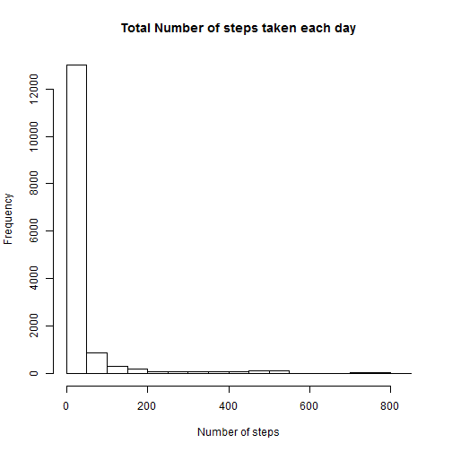
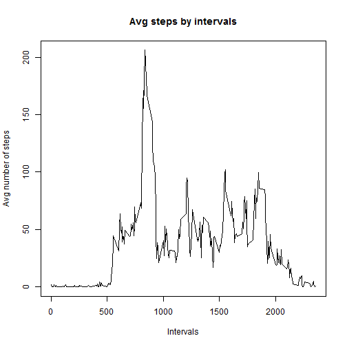
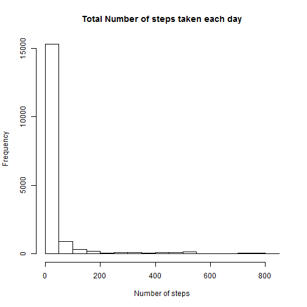
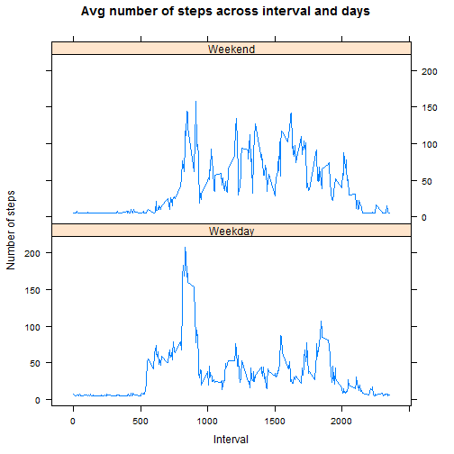

Part1: We first need to load data into R. For this, we first create data directory within the system and then, read the csv file into variable called activityMonitor. Following is the code to load data.Since the folder was already created and the file was unzipped, the results are hidden only for this code snippet


```r
#Step1: Get the data

#Check if directory exists. If not, create one and download zip file into the folder created. Then, unzip the
#downloaded file and extract its contents

options(warn = -1)
if (!file.exists("./PeerAssesment1")) {dir.create("./PeerAssessment1")}

fileURL <- "https://d396qusza40orc.cloudfront.net/repdata%2Fdata%2Factivity.zip"

download.file(fileURL, dest = "./PeerAssessment1/Data.zip", method = "curl")

unzip ("./PeerAssessment1/Data.zip", exdir = "./PeerAssessment1")

list.files("./PeerAssessment1")

activityMonitor <- read.csv ("./PeerAssessment1/activity.csv")
```


Part2: In order to compute the mean and median of steps taken and to draw histogram of steps taken, following code was used. Note that all the NAs have been ignored as part of the computations. As we can see the mean steps is 37.38 and median of steps is 0. 


```r
activityMonitor <- activityMonitor[complete.cases(activityMonitor),] #first of all remove all NAs

stepsMean <- mean (activityMonitor$steps) #compute mean of steps taken across the whole data set

print (stepsMean)
```

```
## [1] 37.38
```

```r
stepsMedian <- median (activityMonitor$steps) #compute median of steps taken across the whole data set

print (stepsMedian)
```

```
## [1] 0
```

```r
hist (activityMonitor$steps, main = "Total Number of steps taken each day", xlab = "Number of steps", 
      ylab = "Frequency") #draw histogram of steps taken after omitting NAs
```

 


Part3: In this part, time series plot of number of steps vs interval is created. For this , we first compute average of steps taken for each interval. Based on the plot, we see that the maximum number of steps are present in the interval of 104minutes


```r
#compute average of steps taken for each interval         bucket
stepsAvg <- aggregate (steps~interval, data = activityMonitor, mean) 

#Now, create a time series plot of average steps taken vs interval
plot (stepsAvg$interval, stepsAvg$steps, type = "l", main = "Avg steps by intervals", xlab = "Intervals", 
      ylab = "Avg number of steps")
```

 

```r
#compute the record for which we have max number of average steps taken
maxSteps <- subset (stepsAvg, steps == max(steps))
print (maxSteps)
```

```
##     interval steps
## 104      835 206.2
```

Part4: For this part, the number of missing values were computed, which comes out to *2304 rows* and then, these missing values were substituted with mean of all the steps across the data set and new data set was created called activityMonitorNew. 

Again, a historam was created and mean and median of this new data set was computed and printed. 

Since I substituted the missing values with overall data mean, there does not seem to be any difference between the mean without missing missing data and the mean with missing data being substituted. Same holds true for median as it remained unchanged. So, as we can see, if we substitute the missing values with overall data mean, the mean and median remains unchanged. 


```r
#load the data again (with NAs)
activityMonitorNew <- read.csv ("./PeerAssessment1/activity.csv")

#Compute number of rows with missing data and print the result
activityMonitorMissing <- activityMonitorNew[is.na(activityMonitorNew),]
missingRows <- nrow (activityMonitorMissing)
print (missingRows)
```

```
## [1] 2304
```

```r
#substitute the missing data with avg of steps across all the data
activityMonitorMissing$steps <- mean(activityMonitorNew$steps, na.rm = TRUE)

#compute subset of original data without any missing rows of data
activityMonitor <- activityMonitor[complete.cases(activityMonitor),]

#now, combine the above two data sets. Thus we have same rows from the original data set, but without any missing data
activityMonitorNew <- rbind(activityMonitorMissing, activityMonitor)

#compute mean on the new data set and print it
newStepsMean <- mean (activityMonitorNew$steps)
print (newStepsMean)
```

```
## [1] 37.38
```

```r
#compute median on new data set and print it
newStepsMedian <- median (activityMonitorNew$steps)
print (newStepsMedian)
```

```
## [1] 0
```

```r
#plot the histogram
hist (activityMonitorNew$steps, main = "Total Number of steps taken each day", xlab = "Number of steps", 
      ylab = "Frequency")
```

 


Part 5: 
For this part, the same new data is used that was computed in part4. First of all, we convert the date column to date format and then, we apply weekdays() to the date column in order to create a new column called days. The "day" column consists of all the days of a week. These days are then grouped into "weedays" and "weekends" appropriately. 

Later, we compute average of all the steps taken by weekdays / weekends and intervals and store this data in a new dataframe called *activityMonitorAvg*

We then load lattice graphing system and plot a graph of average number of steps taken averaged across the interval and weekdays / weekends. 


```r
#format the date column as Date class
activityMonitorNew <- transform (activityMonitorNew, date = as.Date (date, format = "%Y-%m-%d"))

#add a new column called "day" that gives all the weekdays corresponding to a given date
activityMonitorNew <- transform (activityMonitorNew, day = weekdays(activityMonitorNew$date, abbreviate = TRUE))

#add another column called "weekdayend" which will correspond to weekday / weekend days
activityMonitorNew$weekdayend <- ifelse(activityMonitorNew$day == "Sat" | activityMonitorNew$day == "Sun", 
                                        "Weekend", "Weekday")

#now, calculate mean of steps across intervals and weekday / weekend days and store that information in a new data #frame called "activityMonitorAvg"
activityMonitorAvg <- aggregate (steps~interval+weekdayend, data = activityMonitorNew, FUN = mean)

#create a time series plot of of the 5-minute interval (x-axis) and the average number of steps taken, averaged across #all weekday days or weekend days (y-axis)

library(lattice)
xyplot (steps~interval | weekdayend,data = activityMonitorAvg, type = "l",layout = c(1,2),xlab = "Interval", ylab = "Number of steps", main = "Avg number of steps across interval and days")
```

 
